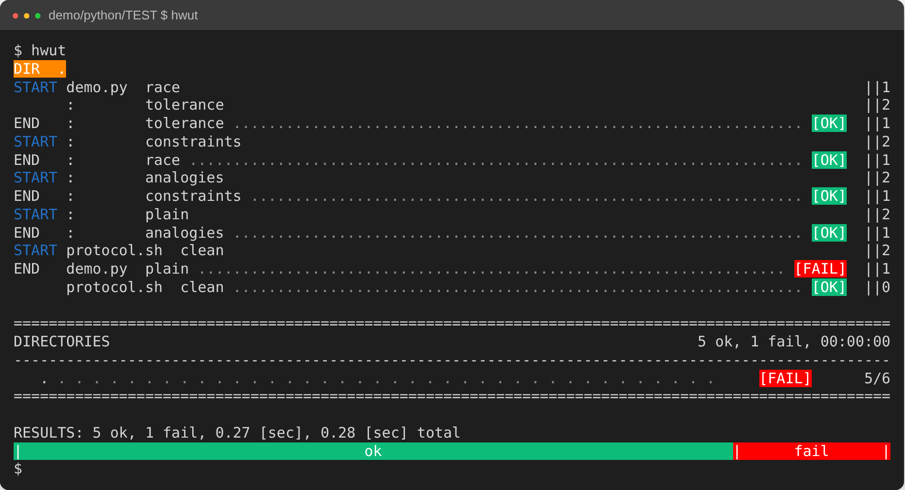
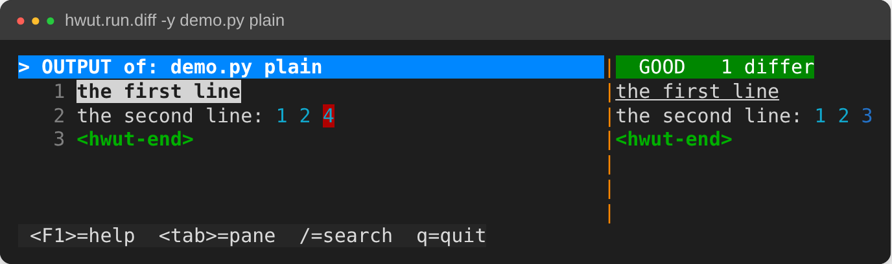
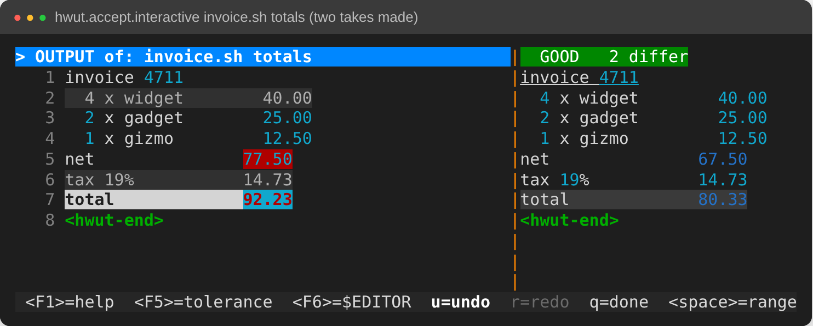
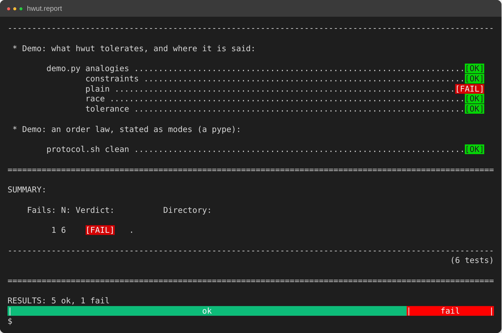
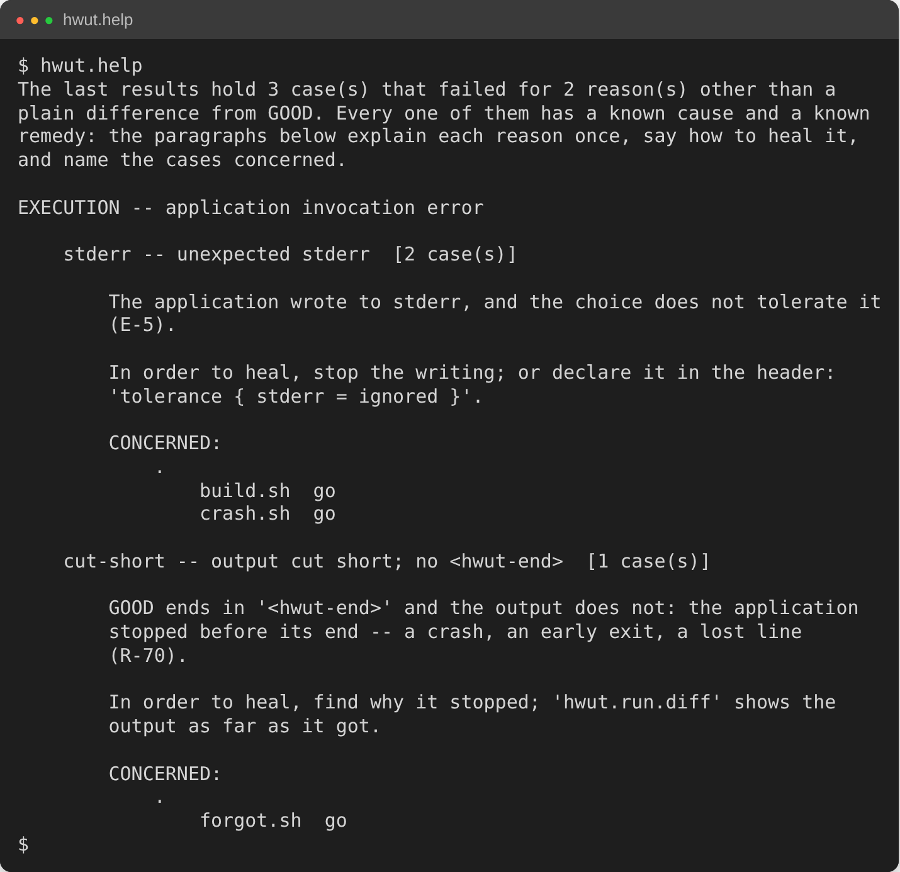

# HWUT 2.0 — tolerant golden-master testing

A test is a picture. The program prints what it does, in the terms of the
problem. A person looks at the picture and blesses it. From then on HWUT
judges every run against the blessed picture — the GOOD file — and where a
run may differ, the GOOD file says so, in the place where the expected
behaviour is written.

An assert can only fail on a hypothesis its author already had. A blessed
picture fails on everything.

```
test application ----> stdout ----> compare <---- GOOD/<app>--<choice>.txt
(any executable)                       |            the picture, plus the
                                       v            tolerances it grants
                              [OK] or [FAIL] + the
                              two texts side by side
```

The test application links nothing, imports nothing and registers nothing:
HWUT sees the process boundary only. `hwut.accept` records a GOOD file. A
stream that does not end in `<hwut-end>` never completed and is not
accepted.

## Try it

Three commands, about a minute. Python 3.10 or newer.

```
git clone https://github.com/fschaef/hwut && cd hwut
pip install bidict rapidfuzz regex typeguard
cd vut/demo/python/TEST && ../../../bin/hwut --plain
```

```
RESULTS: 6 ok, 0 fail
```

`demo.py` and `protocol.sh` print six choices between them. Every run is
seeded by the clock or the scheduler, so the output differs from run to run,
and every choice passes anyway. The header at the top of each file is the
whole configuration; its comment says what the choice shows.

Optional: `pip install prompt_toolkit` enables the keyed merge, `hwut.accept`
on a terminal.

## Describing behaviour the way it happens

There is no assertion API. The program prints, and the printed text is the
specification: a GOOD file reads as a description of the behaviour, line by
line, and a reviewer reads it as such.

Output that varies is described as varying, in the GOOD file:

| In the GOOD file | Means |
|---|---|
| `greeting: hello, world` | any of an `eq_pattern` list of greetings |
| `value:    19.93` | a number within a ratio of the GOOD's |
| `open  ((df17)) input.txt`, `read  ((df17)) 17 lines` | a handle: any value, the same value wherever the handle appears |
| `load  ((load: 71.3)) %` | a value that must obey a law: 0..100 |
| `twice ((twice: 34))` | a law over two values: `twice == 2 * once` |

Blocks are described as blocks. A region opens with `##! <kind>` and closes
with `####`, on both sides:

| Region | The block is |
|---|---|
| `##! potpourri` | the same lines, in any order |
| `##! table` | rows of columns; per column numeric tolerance or ignore; rows keyed or in any order |
| `##! point-cloud` | numeric vectors, each within a distance of a partner, or each satisfying an expression |
| `##! verbatim` | byte-exact, no tolerance of any kind |
| `##! ignore` | its contents take no part |

A line missing, extra or different still fails. The tolerance is a line
somebody wrote; HWUT infers none.

## Order, tamed: potpourri

The `race` choice of `demo.py`: three threads print as they finish. The order
is the scheduler's. The program opens an unordered block and closes it:

```
start                           start
##! potpourri                   ##! potpourri
worker A done: 3 jobs           worker C done: 2 jobs
worker B done: 5 jobs           worker A done: 3 jobs
worker C done: 2 jobs           worker B done: 5 jobs
####                            ####
all joined                      all joined
<hwut-end>                      <hwut-end>
GOOD/demo.py--race.txt          one possible run
```

15 of 15 runs pass. The same output compared in order, without the markers,
failed 12 of 15 runs on a two-core machine. A worker that did not report, or
reported 4 jobs, fails the block: the order is free, the facts are not.

A potpourri says "any order". It cannot say "this before that", "exactly
once", "answered before shutdown". That is what pype says.

## Order, tamed: pype, the law as states

`hwut.pype` is a filter language between the test application and the
comparison. A script has **modes** — the states the behaviour has — and
**handlers**: a line pattern, and what happens when it arrives (switch mode,
push, pop, run Python, print). The application reports as things happen; the
script holds the law and prints a verdict that does not depend on the order
the lines arrived in.

```
my-test | ./law.pype            deterministic text, then compared
```

The `clean` choice of `protocol.sh` pipes five concurrent clients through
`protocol.pype`. Its law, abridged:

```
SERVING   a request opens an exchange, a response closes it, 'shutdown'
          ends the service
CLOSED    nothing may arrive any more

SERVING/on: "request"  <id = int> => { ... open_db.setdefault(id, 0) }
SERVING/on: "response" <id = int> => { ... open_db[id] += 1 }
SERVING/on: "shutdown"            => goto CLOSED;
CLOSED/on:  "request"  <id = int> => { breach_set.add(...) }
CLOSED/on:  "response" <id = int> => { breach_set.add(...) }
ANY/on:     <eof>                 => { print the verdicts, sorted }
```

Five clients, a different order in every run, one text:

```
exchange 1: answered
exchange 2: answered
...
law: kept
<hwut-end>
```

The same script on a stream that breaks the law (in `demo/python/TEST`):

```
printf '%s\n' "request 1" "response 1" "response 1" "response 9" \
    "request 2" shutdown "request 4" | ../../../bin/hwut.pype protocol.pype
```

```
exchange 1: answered 2 times
exchange 2: NOT answered
BREACH: request 4 after shutdown
BREACH: response 9 without a request before it
law: BROKEN
<hwut-end>
```

What the laws of this kind say — precedence ("a response only after its
request"), exactly once, "every request answered before shutdown", nothing
after the end, a wait that must not exceed a limit (`pype.time()`) — are what
temporal-logic monitors state as formulas. Here they are stated as the states
the protocol has, in its own words, and the verdict is a text that is blessed
like any other picture.

```
hwut.pype --dry-run law.pype    syntax, inheritance, mandatory 'else'
hwut.pype --trace law.pype      every input line against the handler it
                                fired, on stderr, as 'file:line:'
hwut.pype --example law.pype    a generated input for the script
```

Modes inherit (`is:`). Two handlers of one mode whose patterns could match
the same line are refused at parse time, so dispatch does not depend on
definition order. Where a script is part of the oracle, the manual says so:
[`vut/test_writing_support/hwut_pype/MANUAL.txt`](vut/test_writing_support/hwut_pype/MANUAL.txt).

Where a tolerance can absorb a difference, a tolerance is stated. Where the
output can be understood, a pype states the understanding, and what remains
is compared byte-exact.

## A failure, from run to blessing

Break one line of the demo and run again, in `demo/python/TEST`:

```
sed -i 's/1 2 3/1 2 4/' demo.py
../../../bin/hwut
```

**`hwut`** runs the whole tree below the current directory (`hwut` is
`hwut.run`). One choice is red, the rest are green, the exit status is 1.



**`hwut.run.diff -y demo.py plain`** shows the subject on the left, what the
program printed now, and the nominal on the right, the GOOD file. The
differing token is marked.



**`hwut.accept.interactive`** is the merge, with keys. Here an invoice report
changed in four lines; two have been taken into GOOD (`Enter`), two still
differ. `a` takes a region, `A` the whole subject, `u` undoes, `F5` opens the
tolerance pane.



**`hwut.report`** reads the result databases, not a run, and renders them for
somebody else.



**`hwut.help`** explains each failure that is not a plain difference from
GOOD, once: its cause, the remedy, the cases concerned. Here a program wrote to
stderr and another stopped before `<hwut-end>`.



Restore the demo with `sed -i 's/1 2 4/1 2 3/' demo.py`. The screenshots are
made from real runs by [`vut/adm/screenshots/make.sh`](vut/adm/screenshots/make.sh).

## The commands

46 launchers stand in `vut/bin`; put it on `PATH` to call them by name:

```
export PATH=$PWD/vut/bin:$PATH
```

Every command answers `--help` with its full documentation and takes
`--directory=<path>`. Exit status is common to all: 0 ok, 1 a fault or a
failed test, 2 the command line cannot be read, 3 it asks for nothing.
[`vut/services/README.txt`](vut/services/README.txt) lists every one in full.

**Run**

| Command | What it does |
|---|---|
| `hwut` | the default command: `hwut.run` over the whole tree below the current directory |
| `hwut.run` | runs the tree and renders it live; the wish selects: `--fail`, `--pass`, `--since`, `--glob`, labels; `--jobs` bounds parallel work |
| `hwut.run.play` | runs one choice and shows how compare reads what it printed; judges nothing, records nothing |
| `hwut.run.diff` | how a run compares with its GOOD file, side by side (`-y`); the verdict view |
| `hwut.run.stability` | runs a wish several times and reports what did not stay the same |
| `hwut.plan` | prints the test plan the framework intends: nodes, links, exclusion sets |
| `hwut.execute` | runs one user-defined target over every directory that binds it |

**Accept**

| Command | What it does |
|---|---|
| `hwut.accept` | promotes a candidate to the nominal. Partial by default: a first acceptance records the shape with nothing decided; `--whole` blesses the candidate as it stands |
| `hwut.accept.interactive` | the merge with keys: take lines, regions or the whole subject into GOOD, edit, undo, adjust tolerances |
| `hwut.accept.propose` | writes the differences as a file to read; blesses nothing |
| `hwut.accept.apply` | blesses what such a file names, and nothing else |

**Report**

| Command | What it does |
|---|---|
| `hwut.report` | what the result databases hold, rendered for somebody else |
| `hwut.report.details` | packs one test whole — source, GOOD, output, coverage — for another pair of eyes |
| `hwut.report.timings` | what this machine measured, read back from the traces |
| `hwut.report.wishlist` | lists every test and choice a wish selects |
| `hwut.report.wallflowers` | lists files in test directories that no test application claims |
| `hwut.help` | explains each failure that is not a plain difference from GOOD, once, with its remedy |

**Coverage**

| Command | What it does |
|---|---|
| `hwut.cov.run` | runs the selected cases under their coverage tool and gathers the records into one output directory; no verdicts |
| `hwut.cov.formats` | the table of coverage tools and formats this build reads |
| `hwut.cov.conv.to_humans` | a coverage file as text; `--to binary` for the way back |
| `hwut.cov.conv.to_html` | the output directory as pages: sources, measures, the test runs that executed each line |
| `hwut.cov.conv.to_lcov`, `hwut.cov.conv.to_cobertura`, `hwut.cov.conv.to_jacoco` | the output directory as one tracefile or XML report, for the tools that read those |
| `hwut.cov.conv.to_json` | lossless JSON of everything the directory holds |
| `hwut.cov.conv.to_tex`, `hwut.cov.conv.to_pdf` | a LaTeX document, and that document compiled |

**Labels** — named sets of runs, kept in `hwut-root.labels`

| Command | What it does |
|---|---|
| `hwut.labels.create` | a new label from a wish; refuses one that exists |
| `hwut.labels.add`, `hwut.labels.remove` | grow or shrink a label by what a wish selects |
| `hwut.labels.list`, `hwut.labels.query` | every label with its size; the runs a label expression names |

**Keep the tree in order**

| Command | What it does |
|---|---|
| `hwut.rename`, `hwut.move` | rename a test or one choice, or carry it into another directory, with its GOOD files, book entry and coverage record |
| `hwut.remove` | forgets a test or one choice: nominals, candidates, book entry, register id |
| `hwut.remove.propose`, `hwut.remove.apply` | the same for every run whose record has lost its ground: a file to read, then do |
| `hwut.sanitize` | does one command of a proposal: remove a stale session, forget an orphan, book a nominal, and so on |
| `hwut.sanitize.propose`, `hwut.sanitize.apply` | what a tree accumulates, as commands to read and edit; then do them |
| `hwut.renovate` | carries what hwut 1.0 said into what 2.0 reads |
| `hwut.config.show` | the configuration the framework read, as a tree with its provenance |
| `hwut.config.ignore` | declares a file a helper, not a test application, in the directory's `hwut.conf` |

**Language and development**

| Command | What it does |
|---|---|
| `hwut.pype` | the line-matching filter language, as a command |
| `hwut.dev.podman.build`, `hwut.dev.podman.enter` | the development container: build the image, enter it over the host's tree |

## What is in the tree

| Path | Holds |
|---|---|
| `vut/bin/` | the launchers above |
| `vut/services/` | the commands; its `README.txt` lists every one |
| `vut/engine/` | compare (tolerant comparison), orchestrator, bookkeeper, coverage, display, operations, procsitter |
| `vut/test_writing_support/hwut_pype/` | pype |
| `vut/demo/` | the demos above |
| `vut/adm/` | development tools; `PHILOSOPHY.txt` states the model |

Where to read next:

- [`vut/engine/compare/MANUAL.txt`](vut/engine/compare/MANUAL.txt) — every tolerance and region, with examples
- [`vut/test_writing_support/hwut_pype/MANUAL.txt`](vut/test_writing_support/hwut_pype/MANUAL.txt) — the pype language
- [`vut/adm/PHILOSOPHY.txt`](vut/adm/PHILOSOPHY.txt) — what a test is, and when it is worth having
- [`vut/services/README.txt`](vut/services/README.txt) — every command, its words, its exit status

## Status

- 2.0 is a complete rewrite of 1.0 and a spare-time project.
- Tests: 911 ok, 1 fail (`services/TEST/test-dev_podman.py refused`), measured by `hwut` from the root at commit `70417c0` (branch `26y10m4d-review-todo-and-done`).
- Not there yet: a PyPI package or `pyproject.toml`; a test suite in a language other than Python and shell. All test applications in the tree are Python or shell.
- Open work: `vut/adm/WORK/TODO.txt`.

## License and no warranty

MIT License. Copyright (c) 2026 fschaef. The full text is in the file
[`LICENSE`](LICENSE). Its warranty clause, verbatim:

> THE SOFTWARE IS PROVIDED "AS IS", WITHOUT WARRANTY OF ANY KIND, EXPRESS OR
> IMPLIED, INCLUDING BUT NOT LIMITED TO THE WARRANTIES OF MERCHANTABILITY,
> FITNESS FOR A PARTICULAR PURPOSE AND NONINFRINGEMENT. IN NO EVENT SHALL THE
> AUTHORS OR COPYRIGHT HOLDERS BE LIABLE FOR ANY CLAIM, DAMAGES OR OTHER
> LIABILITY, WHETHER IN AN ACTION OF CONTRACT, TORT OR OTHERWISE, ARISING
> FROM, OUT OF OR IN CONNECTION WITH THE SOFTWARE OR THE USE OR OTHER
> DEALINGS IN THE SOFTWARE.
